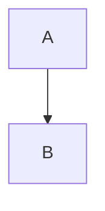

# Diagram Expert Skill

## 概述

使用 Mermaid、PlantUML 创建技术图表。

## 何时使用

- 需要展示架构
- 需要展示流程
- 需要展示数据模型

## Mermaid 支持

### 流程图

````mermaid
graph TD
    A[开始] --> B{判断}
    B -->|是| C[执行A]
    B -->|否| D[执行B]
````

### 时序图

````mermaid
sequenceDiagram
    participant A as 用户
    participant B as 系统
    A->>B: 请求
    B-->>A: 响应
````

### 类图

````mermaid
classDiagram
    class Animal {
        +String name
        +eat()
    }
    class Dog {
        +bark()
    }
    Animal <|-- Dog
````

## 使用方式

在 markdown 中直接使用：

```markdown

```

## 常见图表

| 场景 | 推荐图表 |
|------|---------|
| 流程 | flowchart |
| 时序 | sequenceDiagram |
| 架构 | C4 或 component diagram |
| 数据 | classDiagram |
| 状态 | stateDiagram |
